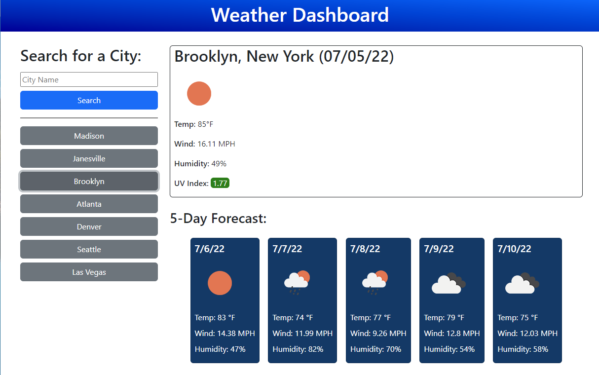

# Weather Forecaster

## Description

This weather application is used to check the current weather conditions and the 5-day forecast for the searched city. It has icons to show the weather conditions for that day and features a UV index indicator to show if the UV index is favorable, moderate, or severe. 

This is our week 6 challenge to use a weather API and further solidify our learning this week in server side APIs. I decided to use jQuery for this project as well in order to solidify my knowledge on jQuery. This project really helped me understand how to fetch and manipulate the data when using server side APIs. 

## Built With:

* HTML
* CSS 
* JavaScript
* Bootstrap
* jQuery
* Moment.js
* OpenWeather One Call API

## Usage

This was built to create a simple and easy way to check weather for multiple cities.

Checkout the finished project here: https://oceanlatte.github.io/weather-forecaster/

## Credits

Thank you to [Open Weather](https://openweathermap.org/api/one-call-api) for providing the weather data! 